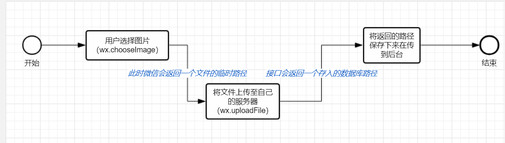

#### 微信小程序上传图片

流程



``` 
微信小程序上传图片是需要接受一次路径之后在返回给后台的。
另外，小程序每次只能提交一张图片，所以如果需要一次上传多张图片，就要利用递归来完成
```

<span style="color:#9d3333">参考链接:https://blog.csdn.net/qq_37330773/article/details/77951457 </span>

